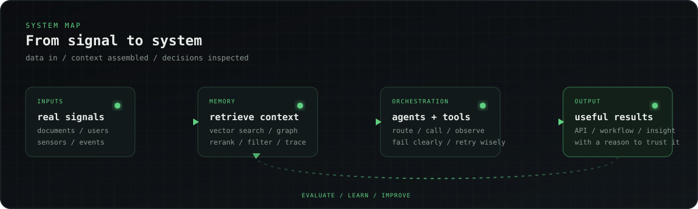

  <h1>Daniel Yamanoğlu</h1>
  
<strong>AI/ML Engineer</strong> · RAG · Agent Systems · Backend

  
Building systems that retrieve the right context, use tools, and leave useful traces when they fail.

  

    <a href="https://danielyamanoglu.github.io/">Portfolio</a>
    ·
    <a href="https://www.linkedin.com/in/daniel-yamano%C4%9Flu-75516a203/">LinkedIn</a>
    ·
    <a href="https://danielyamanoglu.github.io/Daniel_Yamanoglu_CV.pdf">Résumé</a>
    ·
    <a href="mailto:yamanogludaniel@gmail.com">Email</a>
  

<pre><code>$ whoami
daniel / AI-ML engineer

$ currently
retrieval + agent memory + Python backends

$ location
Istanbul → Remote / Global
</code></pre>

## About

I work in the awkward middle layer where a model meets a database, an API, a sensor, or a user who did not follow the happy path.

My background is in Control &amp; Automation Engineering, so I naturally care about state, signals, feedback, and failure modes. I am equally happy thinking about a Kalman filter or a FastAPI endpoint, preferably with good logs for both.

I spend a healthy amount of time asking agents two questions: **what did you retrieve, and why?**

  

<table>
  <tr>
    <td width="33%" valign="top">
      BUILDING NOW 
      <strong>Agent memory</strong> 
      Retrieval, context, traces.
    </td>
    <td width="33%" valign="top">
      THE QUESTION 
      <strong>What did you retrieve?</strong> 
      And why did you use it?
    </td>
    <td width="33%" valign="top">
      OPEN TO 
      <strong>AI/ML + backend</strong> 
      Istanbul · remote / global.
    </td>
  </tr>
</table>

> Models with evidence. APIs with useful errors. Logs that tell the truth.

## What I build

<table>
  <tr>
    <td width="50%" valign="top">
      <h3>Retrieval &amp; memory</h3>
      Embeddings, reranking, vector search, graph memory, and evaluation flows.
    </td>
    <td width="50%" valign="top">
      <h3>Agents &amp; tools</h3>
      Routing, tool calls, structured context, memory, and failure handling.
    </td>
  </tr>
  <tr>
    <td width="50%" valign="top">
      <h3>Applied ML</h3>
      XGBoost, SHAP, neural models, sensor data, and predictive workflows.
    </td>
    <td width="50%" valign="top">
      <h3>Backend systems</h3>
      Python, FastAPI, Docker, async APIs, and data-focused services.
    </td>
  </tr>
</table>

## Things I have built

| Build | The short version |
| --- | --- |
| [**Life OS**](https://danielyamanoglu.github.io/#projects) | A personal knowledge system with Telegram input, Neo4j graph memory, and three agents for capture, categorization, and retrieval. |
| [**Matchfluence**](https://danielyamanoglu.github.io/#projects) | Backend infrastructure for creator-brand matching, data models, analytics, and dashboard APIs. |
| [**ML Risk Analytics**](https://danielyamanoglu.github.io/#projects) | An XGBoost turnover-risk model that reached **91.7% accuracy**, with SHAP explanations to make the output inspectable. |
| [**EKF + Fuzzy-CTC**](https://danielyamanoglu.github.io/#projects) | A 2-DOF robot-manipulator thesis where state estimation meets fuzzy compensation and computed-torque control. |
| [**RAG Experiments**](https://danielyamanoglu.github.io/#projects) | Ongoing work on semantic retrieval, reranking, query planning, and measuring what an agent actually got right. |

## My usual toolbox

  <code>Python</code>
  <code>FastAPI</code>
  <code>Docker</code>
  <code>PostgreSQL</code>
  <code>Qdrant</code>
  <code>Neo4j</code>
  <code>PyTorch</code>
  <code>XGBoost</code>
  <code>SHAP</code>
  <code>LangChain</code>
  <code>LangGraph</code>
  <code>TypeScript</code>
  <code>C/C++</code>

## Small rules I code by

- Make the state and data flow visible.
- When retrieval is empty, return a useful signal instead of a confident guess.
- A vector database can store context; it cannot replace evaluation.
- Test the empty, stale, slow, and malformed cases too.

## Currently

Exploring agent memory, retrieval evaluation, and Python-first backends for AI products.

I am open to AI/ML Engineer, Applied AI, and Python backend roles in Istanbul or with remote teams.

If you are building systems that connect models to real data, [say hello](mailto:yamanogludaniel@gmail.com).

  Portfolio · <a href="https://danielyamanoglu.github.io/">danielyamanoglu.github.io</a>

